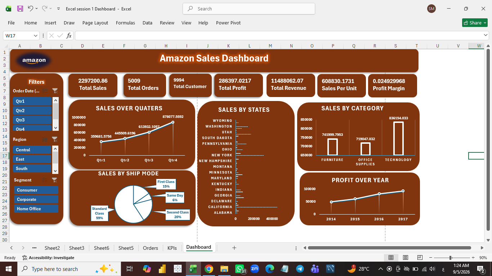

# 📦 Amazon Sales Dashboard (Excel)

An interactive, custom-designed executive sales dashboard built in Microsoft Excel to track and analyze multi-year retail performance, regional metrics, shipping methods, profitability, and customer trends.

---

## 📊 Dashboard Overview

  

---

## 💻 Repository View

  

---

## 📁 Repository Files
- **`Dashboard.png`**: High-resolution visual capture of the primary executive dashboard.
- **`Excel_Dashboard.xlsx`**: The complete, interactive Excel workbook containing raw data, calculations, pivot tables, and dynamic charts.
- **`Row_data/`**: Folder containing the raw source data files (`1- Raw Data - Business Data Set.xlsx`, `Shipping Cost.xlsx`, etc.).

---

## 🛠️ Tools & Technologies Used
- **Microsoft Excel**: For advanced data modeling, dynamic filtering, interactive charts, and executive dashboard UI design.
- **Key Metrics Tracked**: Total Sales, Total Orders, Total Customers, Total Profit, Total Revenue, Sales Per Unit, and Profit Margins.
- **Visual Breakdown**: Sales over Quarters, Sales by States, Sales by Category, Sales by Ship Mode, and Profit Over Years (2014–2017).
